# Getting started with Pilcrow

A walk through the app from a standing start. Fifteen minutes, and you'll have
used every part of it that matters.

Every screenshot here is from the sample project in
[`examples/The Cartographer's Error`](../examples). Open it yourself if you'd
rather poke at something real before starting your own book.

---

## 1. Accept the terms, once

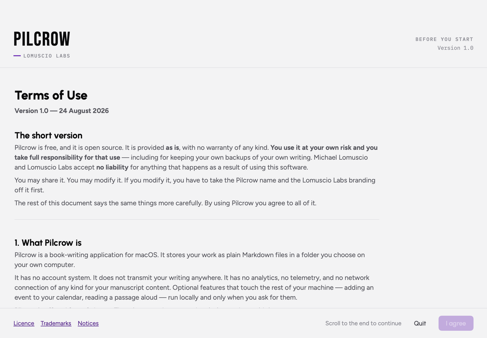

Pilcrow asks you to accept its terms the first time you run it. The short
version: it's free, it's open source, it's provided **as is**, and you're
responsible for your own backups. The "I agree" button stays greyed out until
you've actually scrolled to the end — a checkbox you can tick without reading
is theatre.

You'll only see this again if the terms materially change.

---

## 2. Start a book

Click **Start a New Book**. You give it three things:

- **A title.** This becomes the folder name.
- **A kind.** Fiction, Nonfiction, or Hybrid.
- **A location.** Any folder you like — Documents, a Dropbox folder, a git
  repository, an external drive.

That last one is the important one. Pilcrow doesn't have a library that owns
your files. It makes a folder, and the folder is yours.

> **Which kind?** It's a preset, not a prison. Fiction gives you plot lines,
> characters, and story notes. Nonfiction gives you argument threads, sources,
> concepts, and the evidence ledger. Hybrid gives you both — which is what
> memoir and narrative nonfiction actually want. You can change your mind
> later without losing anything.

---

## 3. Write

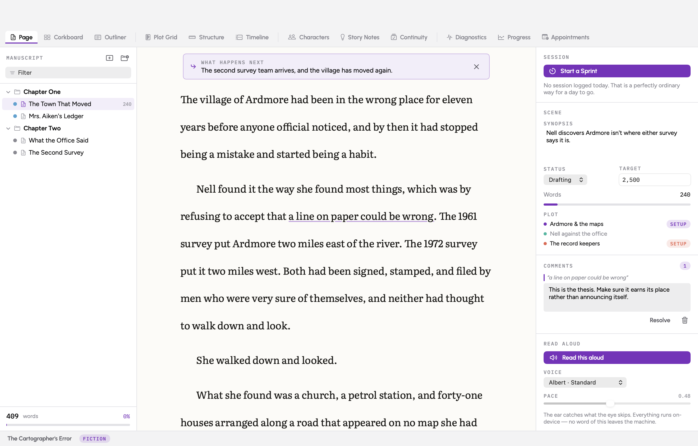

Three zones. The **binder** on the left is the shape of the book. The **page**
in the middle is the only one that matters. The **studio** on the right is
everything true about the document you're standing in.

`⌘N` makes a new scene, `⌥⌘N` a new chapter. Drag things in the binder to
reorder them.

**Two things to try immediately:**

- `⌘\` and `⇧⌘\` hide the rails. `⌥⌘F` hides everything but the page.
- `⇧⌘D` flips between **Draft** and **Revise**. Draft hides spellcheck, word
  counts, and every analysis panel — generate now, evaluate later. Revise turns
  it all on.

The typography is adjustable in the studio: six typefaces, size, leading, and
a measure locked between 55 and 75 characters. If the caret blinking bothers
you, it's off by default; if its *absence* bothers you, there's a checkbox.

At the top of the page you may see **What happens next** — the line you left
yourself when you last closed a session. Write over it.

---

## 4. Run a sprint

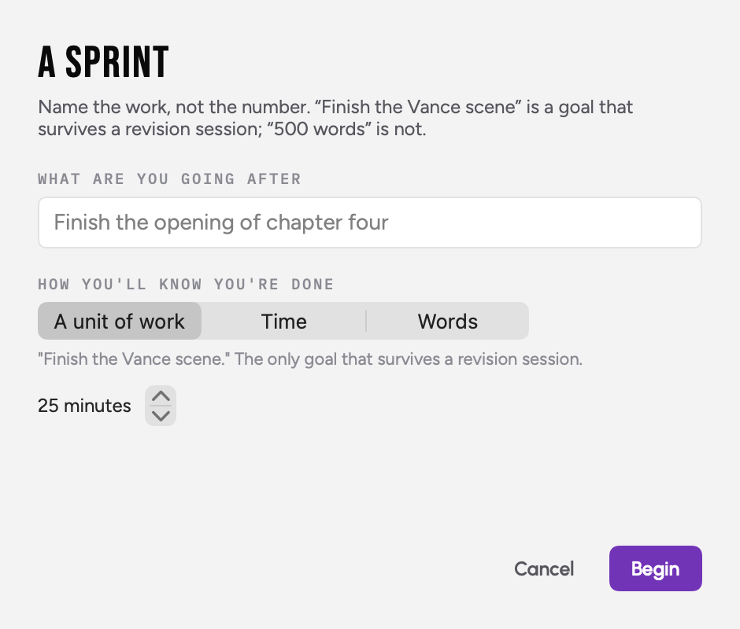

`⇧⌘T`, or **Start a Sprint** in the studio.

Pilcrow asks what you're *going after* before it asks for a number, and
defaults to "a unit of work" rather than a word count. That's deliberate:
"finish the opening of chapter four" survives a revision session, and "500
words" doesn't.

The ring fills, the counter runs, and words added and words cut are tracked
separately.

### Closing up

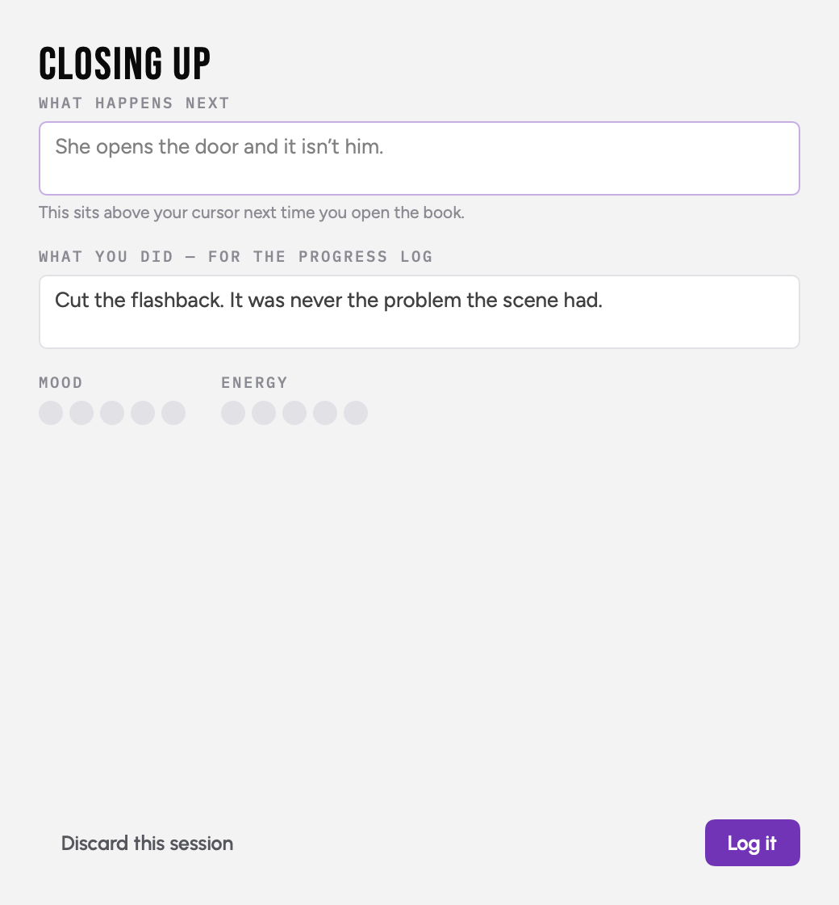

When you close a session it asks two questions:

- **What happens next?** One line. It sits above your cursor next time.
- **What did you do?** For the progress log. "Cut the flashback — it was never
  the problem the scene had" is a better record than "−800".

Both are optional, both take ten seconds, and both are the difference between
a log you'll read and a number you'll ignore.

---

## 5. Find the shape of it

### The Plot Grid

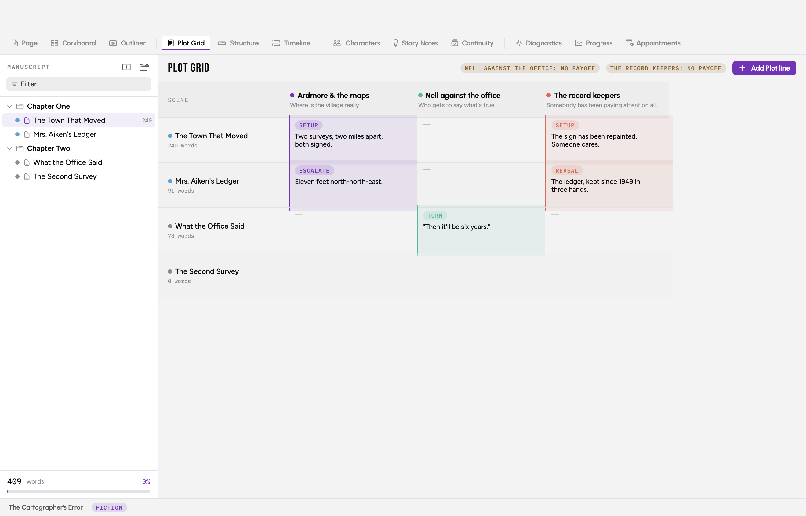

Columns are threads, rows are scenes, cells are what happens. Give each thread
a **promise** and a **payoff** and the board will tell you when a thread goes
quiet for a long stretch, or when you've promised something you never paid off.

In a nonfiction project this exact board is the **Argument Board**: columns are
claims, and each section introduces, supports, complicates, qualifies, rebuts,
or concludes them.

### Structure

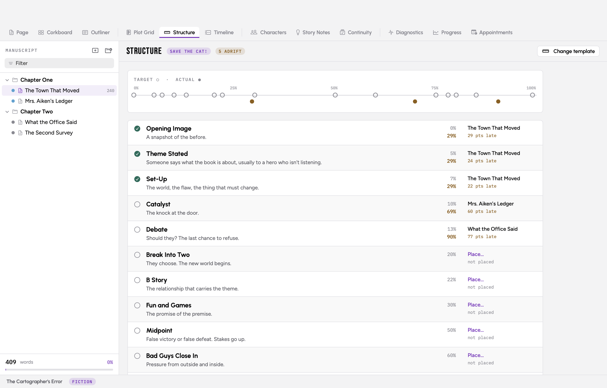

Pick a beat sheet — or don't. If you do, place beats against your scenes and
the ruler shows you where convention puts each one (hollow) against where yours
actually lands (filled).

Position is measured **in words, not chapters**, which is the only measurement
that means anything. A midpoint in chapter twelve of twenty can still be
sitting at 61% of the book.

Drift under eight points is normal. Drift over it is worth a look, not a
crisis.

### Corkboard and Outliner

<div align="center">
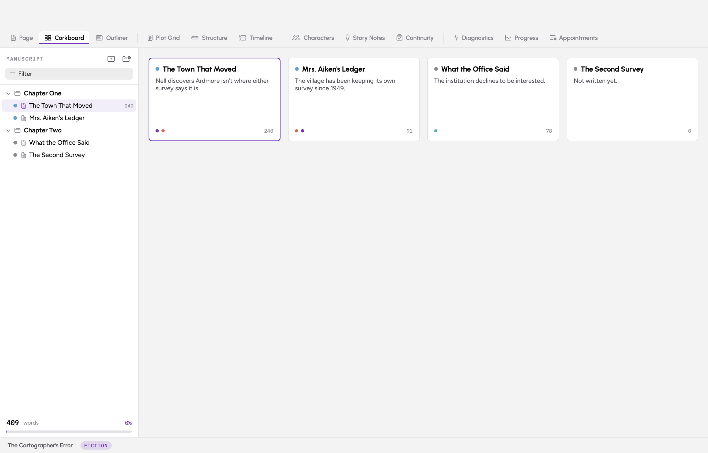
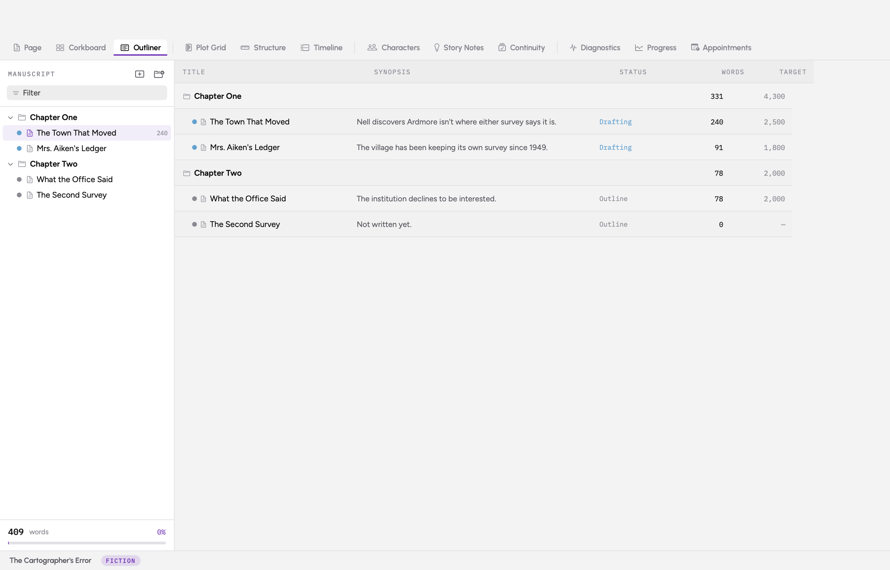
</div>

Same manuscript, two other angles. The corkboard is index cards with synopses.
The outliner is the whole book as a spreadsheet.

---

## 6. Keep track of who and what

<div align="center">
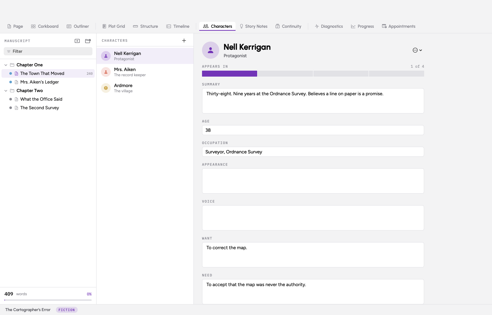
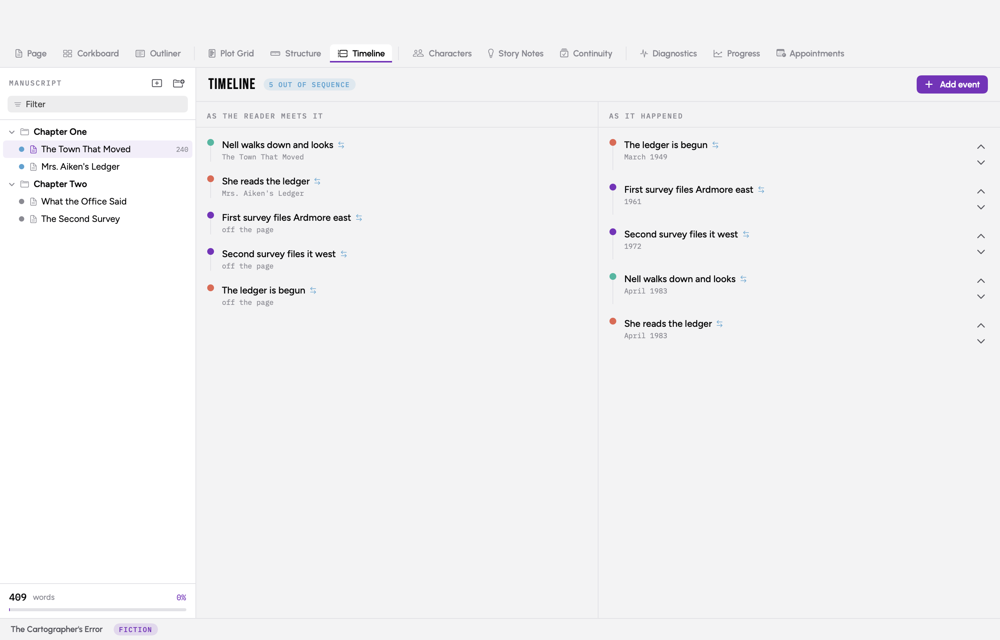
</div>

**Characters** carry the arc fields that actually do work — want, need, the lie
they believe, the wound underneath — plus a strip showing which scenes they
appear in and a warning if they vanish for too long.

**Timeline** runs two tracks: the order the reader meets events, and the order
they happened. Events that sit in different positions get flagged. For a book
with flashbacks that gap *is* the craft problem.

**Continuity** is a ledger of things that have to stay true. Record that
Ardmore has forty-one houses, then record thirty-nine somewhere else, and
Pilcrow flags the pair. It also catches names one character apart and terms you
used before you defined them. It never edits your prose — a contradiction is
sometimes the point.

**Story Notes** are cards with tags and links, plus a mind-map canvas for when
the ideas haven't found their order yet.

---

## 7. If you're writing nonfiction

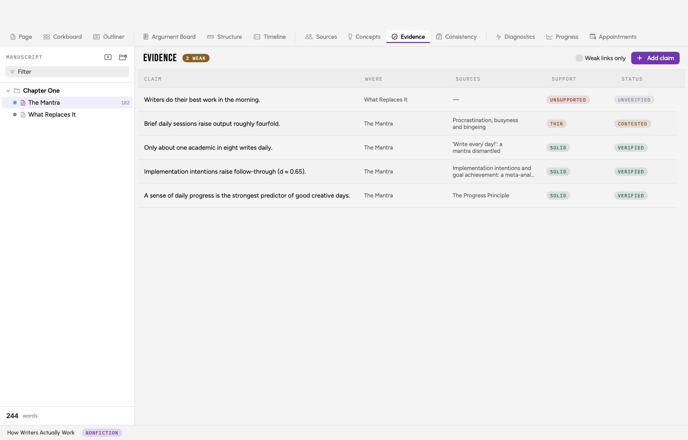

Two features have no fiction equivalent.

**Sources.** Import CSL-JSON straight out of Zotero (**Session → Import
Sources**), or add sources by hand. Each gets a cite key.

**Citations in prose.** Type `[@sword2016]` or `[@sword2016, p. 316]` where the
citation goes. That's pandoc's syntax, so your manuscript stays readable to
every other tool in the chain. Compile turns the markers into numbered endnotes
and a bibliography in Chicago, APA 7, or MLA 9.

**The Evidence ledger.** Log each claim your book makes, attach its sources,
and rate how strong the support really is. Then tick **Weak links only** and
you're looking at exactly the claims carrying more weight than their evidence
can bear — before a fact-checker does.

Compile warns you about cite keys that match no source, and about quotes from
anyone you've marked *needs release*.

---

## 8. Revise

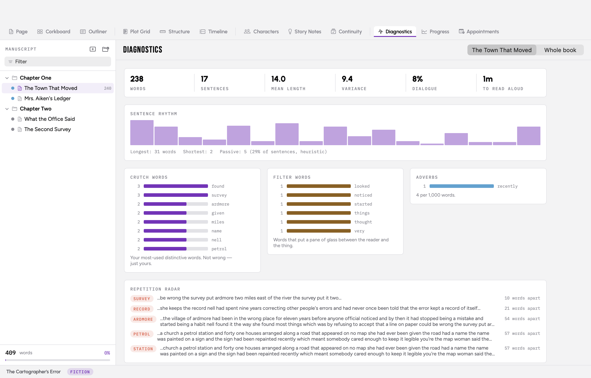

Switch to **Revise** mode (`⇧⌘D`) and open **Diagnostics**.

- **Sentence rhythm** — the bars are your sentences. A flat run means every
  sentence is the same length, which reads as monotonous even when each one is
  good.
- **Crutch words** — your most-used distinctive words. Not wrong. Just yours.
- **Filter words** — *just*, *really*, *seemed*, *felt*. Words that put a pane
  of glass between the reader and the thing.
- **Repetition radar** — the same distinctive word twice inside sixty words,
  with the surrounding text so you can judge it.

Switch to **Whole book** for the pacing curve.

None of this is a score. Cormac McCarthy would fail the punctuation checks and
Hemingway would fail the variance one.

**Then read it aloud.** In the studio, hit **Read this aloud**. The words
highlight as they're spoken. The ear catches what the eye skips, and it all
runs on-device.

### Comments

Select a phrase and press `⇧⌘K`. The comment anchors to the *words*, not the
position, so it survives you rewriting the paragraph around it. Comments never
print and never appear in an export.

---

## 9. Watch your own rhythm

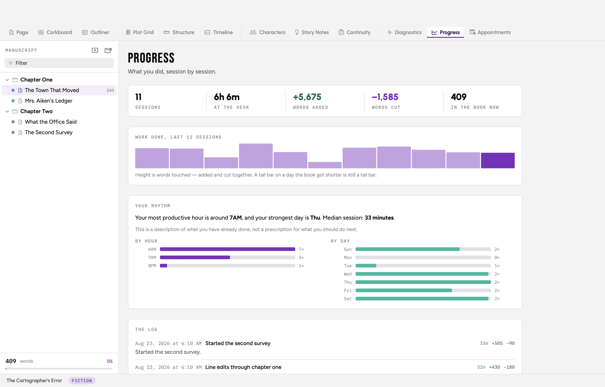

**Words cut sit beside words added, at equal weight.** In revision, cutting
*is* the work — a tracker that only counts words added punishes exactly the
sessions where a book gets good.

After eight or so logged sessions the **Rhythm Report** will tell you when you
actually write best, from your own data. It describes; it doesn't prescribe.

There is no streak. Nothing turns red. Nothing tells you that you've missed a
day. That's a deliberate design decision and the reasoning is in the
[README](../README.md#why-there-is-no-streak-counter).

### Appointments

**Appointments** puts a writing session on your real calendar as an if-then
plan — a time, a place, and a document, rather than a target. It's the
highest-evidence feature in the app.

---

## 10. Get it out

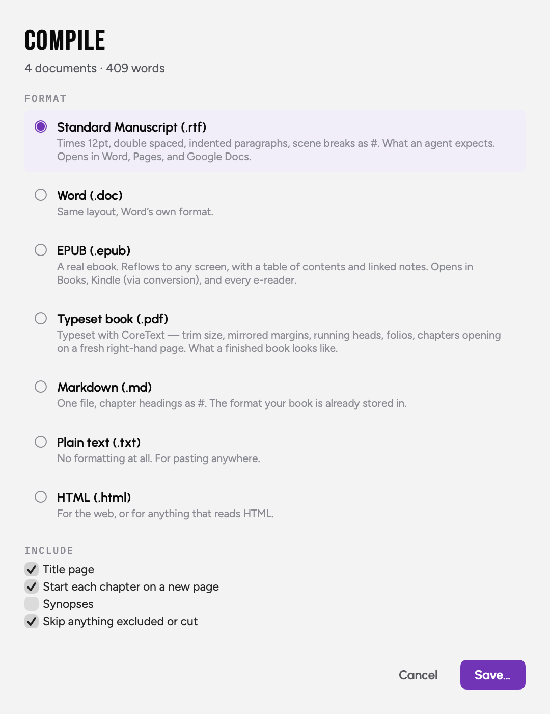

`⌘E`.

- **Standard manuscript (.rtf)** — Times 12pt, double spaced, indented, scene
  breaks as `#`, title page with a rounded word count. What an agent expects.
- **Word (.doc)** — same layout, Word's format.
- **EPUB** — a real ebook, with a table of contents and linked notes.
- **Typeset PDF** — trim size, mirrored margins, running heads, folios, and
  chapters opening on a fresh right-hand page.
- **Markdown / plain text / HTML** — for everything else.

Compile warns you before anything leaves the building: unresolved cite keys,
unsupported claims, quotes from sources marked *needs release*.

---

## Where your work lives

```
The Cartographer's Error/
├── Pilcrow Project.json
├── Manuscript/
│   └── Chapter One/
│       └── The Town That Moved.md
└── .pilcrow/
    ├── sessions.json
    └── snapshots/
```

Open the folder in Finder any time. The `.md` files are your prose, readable in
any editor. **`cd` into the folder and run `git init`** and you have versioned
history of every draft you'll ever write.

Snapshots are taken automatically when you close a session, and you can restore
any of them from the studio. Deleting a document moves its file to the Trash —
nothing is ever unlinked outright.

One thing Pilcrow will not do for you: **keep a backup.** The folder is on your
computer and that's the only copy unless you make another. Time Machine, a
cloud folder, git — pick one.

---

## Keys worth learning first

| | |
|---|---|
| `⌘N` | New scene |
| `⇧⌘D` | Draft ⇄ Revise |
| `⇧⌘T` | Start a sprint |
| `⌥⌘F` | Nothing but the page |
| `⇧⌘K` | Comment on the selection |
| `⌘E` | Compile |
| `⌘1`–`⌘9` | Switch views |

---

Questions, or something broken?
[Open an issue](https://github.com/michaellomuscio/pilcrow/issues).

Built by [Michael Lomuscio](https://michaellomuscio.com).
